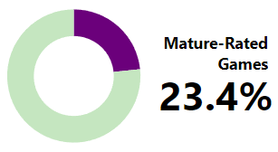
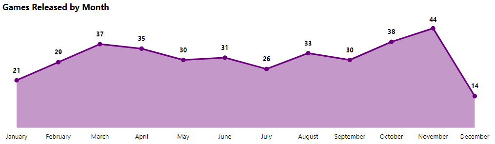
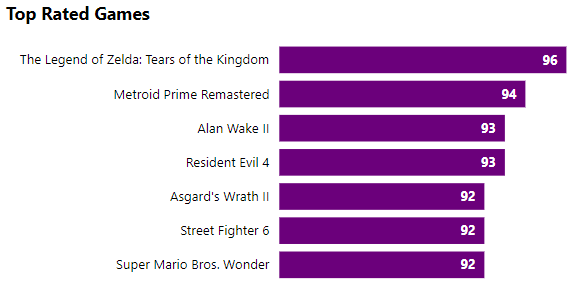
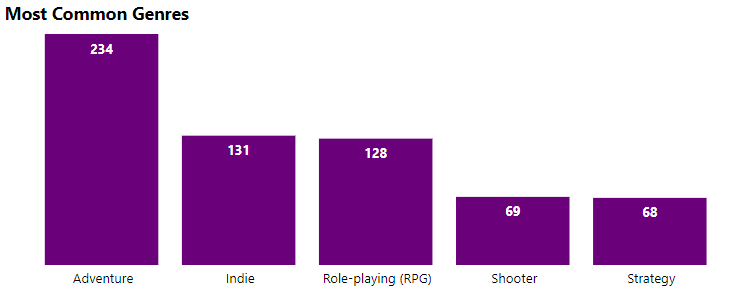
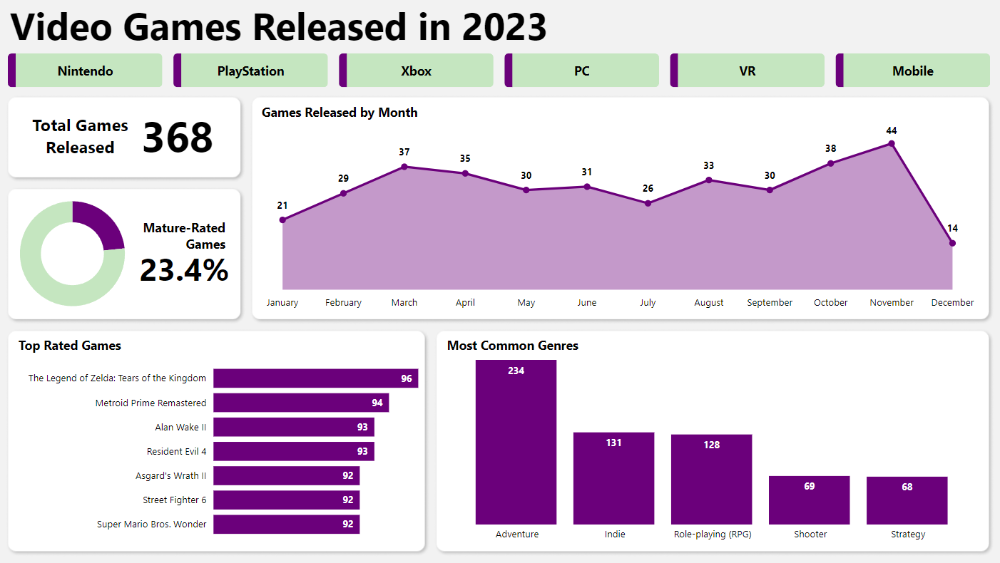

# Analysis of the Video Games Released in 2023

## Table of Contents

- [Introduction](#introduction)
- [Objective](#objective)
- [Data source](#data-source)
- [Methods](#methods)
- [Tools](#tools)
- [Analysis results](#analysis-results)
- [What can be improved](#what-can-be-improved)
- [Dashboard](#dashboard)

## Introduction

2023 was a great year for video games, with releases like The Legend of Zelda: Tears of the Kingdom, Alan Wake II and Resident Evil 4, games that I really enjoyed for their story and gameplay, and many other games that I haven't had a chance to try yet, like Hi-Fi Rush or Lies of P, so I was really interested in learning more about this year's releases, taking the chance to build this project, and developing my data analysis skills and knowledge with it.

## Objective

Analyze the video games released in 2023 by creating an interactive dashboard to answer the following key questions:

- How many video games were released in 2023?
- What percentage of games released have a Mature rating?
- Which month had the most releases?
- Which month had the least releases?
- What were the top rated games of the year?
- What were the most common video game genres this year?

## Data source

The "age-ratings", "genres", "platforms" and "videogames-2023" datasets were created by gathering data from the [Internet Game Database (IGDB) API](https://api-docs.igdb.com/#getting-started).

The Python code used to connect to the API and create the datasets can be found [here](https://github.com/AlexVegaR/Analysis-of-the-Video-Games-Released-in-2023/tree/main/python_code).

The datasets can be found [here](https://github.com/AlexVegaR/Analysis-of-the-Video-Games-Released-in-2023/tree/main/datasets).

## Methods

- Data gathering
- Data wrangling
- Exploratory data analysis
- Data visualization

## Tools

- **Python**: Json, Configparser, Pandas, Requests
- **Power BI**: Power Query, DAX

## Analysis results

According to the Internet Game Database (IGDB), a total of 368 video games were released in 2023, not including games that released their final version this year but were in early access in previous years.

Of the total video games released in 2023, only 23.4% were rated Mature, with Nintendo being the platform with the lowest percentage of Mature-rated games at 9.4%, and VR being the platform with the highest percentage at 50%.

With 44 releases and the most outstanding game being The Talos Principle II, November was the month with the most games released this year, while December was the month with the least games released with 14 releases and the most outstanding game being Asgard's Wrath II.

The Legend of Zelda: Tears of the Kingdom was the highest rated game of 2023 with a score of 96, followed by Metroid Prime Remastered with a score of 94, while Alan Wake II and Resident Evil 4 tied for third place with a score of 93.

The most common video game genre in 2023 was Adventure, with 234 games across all platforms classified as such, followed by Indie with 131 games, RPG with 128, Shooter with 69, and Strategy with 68.

## What can be improved

The API offers a large amount of data to work with, so it is possible to do a lot more analysis on this topic, considering I did not include information on DLCs, publishers, developers, early access games, or the number of sequels released.

## Dashboard

The online Power BI dashboard can be found [here](https://app.powerbi.com/view?r=eyJrIjoiZTNiYTIwNWItYjRjYi00OTU4LWFmNzQtMTU0OGU3ZGQ3ODcyIiwidCI6IjI2NjZiNGUyLWU2MjctNDA2OS05YzkwLWJkNTUxNDQyMjQ0NyIsImMiOjR9).

The Power Query M code used to cleanse and prepare the data can be found [here](https://github.com/AlexVegaR/Analysis-of-the-Video-Games-Released-in-2023/tree/main/power_query_m_code).

